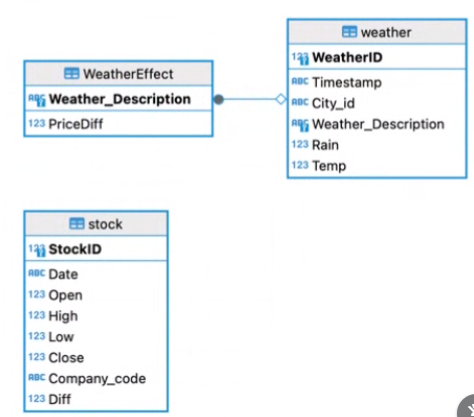

# 天気と株価の関係を示すデータベースの作成プロジェクト
このプロジェクトでは、異なる2つのAPI（Weather Data & APIとYahoo finance）から天気情報と株価情報を取得し、それらを統合して１つのデータベースにすることで天気と株価の関係を示すデータベースをユーザーに提供します。

## セットアップと実行の手順

### 必要なライブラリのインストール
requests: HTTPリクエストを送信するために使用します。
インストール方法: <pip install requests>

pandas: データ処理と統合のために使用します。
インストール方法: <pip install pandas>

sqlite3: SQLiteデータベースの操作のために使用します。通常、Pythonの標準ライブラリとして利用可能です。

DBeaver: データベースを確認するために使用します。
インストール方法:DBeaverを[公式Webサイト](https://dbeaver.io/download/) (英語) からダウンロードしてインストールします。

### APIキーの取得
- APIキーが必要です。それぞれのAPIに登録し、APIキーを取得してください。

## プロジェクトにおける重要な設計とその設計理由

- 天気と株価の関係性を見るため、データベースを以下のER図に示すように設計しました。

- 天気と株価の関係性を見るため、APIで取得したデータから新しい特徴量として、一日の株価の変動値を算出して天気との関係性を示すデータベース<WeatherEffect>を作成しました。

## このツールまたはサービスの使い方の説明 (ユーザー向けの説明)

- <main.py>のスクリプトを実行してください。stock.db , weather.db, WeatherEffect.db の３つのデータベースが作成されます。
- DBeaver等を用いて作成したデータベースを確認してください。それぞれのデータベースでは「日本航空㈱の株価情報」「過去１０日間の東京の天気状況」「過去１０日間の東京の天気状況と、日本航空㈱の株価の変動値（終値ー開始値）の関係」について示しています。

## 使用したAPI
天気情報:
API: Weather Data & API
機能: 都市の現在の天気情報（気温、天気状況、降水量等）を取得します。
ドキュメント: [Weather Data & API](https://www.visualcrossing.com/resources/documentation/weather-api/timeline-weather-api/)

株価情報:
API: Yahoo finance
機能: 特定の銘柄の最新の株価情報（開始値、終値、最高値、最低値等）を取得します。
ドキュメント: [Yahoo finance](https://finance.yahoo.com/?guccounter=1)